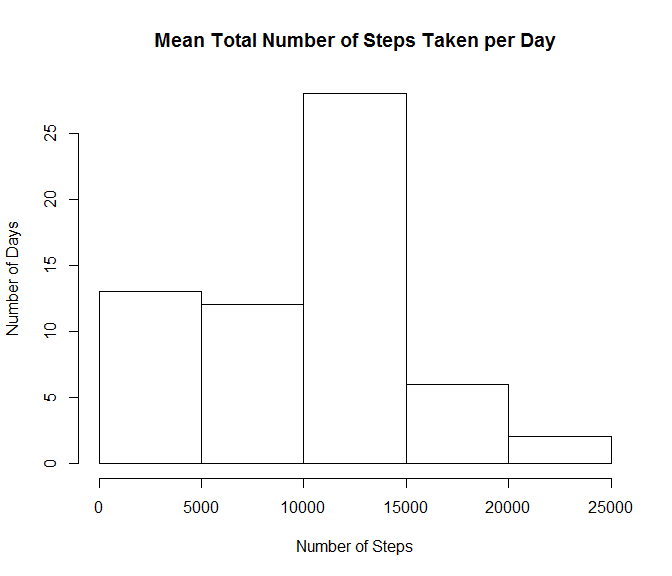

# Reproducible Research: Peer Assessment 1


## Loading and preprocessing the data

```r
activity.data <- read.csv("activity.csv")
activity.data$date <- as.Date(activity.data$date)
```

## What is mean total number of steps taken per day? (A Histogram)

```r
total.steps.per.day <- aggregate(activity.data$steps, by=list(activity.data$date), FUN=sum, na.rm=TRUE)
hist(total.steps.per.day$x, main="Mean Total Number of Steps Taken per Day", ylab="Number of Days", xlab="Number of Steps")
```

 

The mean number of steps per day:

```r
mean(total.steps.per.day$x)
```

```
## [1] 9354.23
```

The median number of steps per day:

```r
median(total.steps.per.day$x)
```

```
## [1] 10395
```

## What is the average daily activity pattern?
A time series plot of the average number of steps taken (averaged across all days) versus the 5-minute intervals:

```r
plot(total.steps.per.day[,1], total.steps.per.day[,2], ylab="average steps taken", xlab="Interval", main="Average Daily Activity Pattern", type="l")
```

 

The 5-minute interval that, on average, contains the maximum number of steps:

```r
average.steps.per.interval <- aggregate(activity.data$steps, by=list(activity.data$interval), FUN=mean, na.rm=TRUE)
average.steps.per.interval[average.steps.per.interval$x==max(average.steps.per.interval$x),1]
```

```
## [1] 835
```

## Imputing missing values

The total number of missing values in the dataset:

```r
sum(is.na(activity.data$steps))
```

```
## [1] 2304
```

My strategy for imputing missing data is to fill in these NA values with the median value for that interval. If no values exist for that interval, I will use 0.

```r
imputed.activity.data <- activity.data

for (i in (min(activity.data$interval)/5):(max(activity.data$interval)/5)) {
    avg <- mean(imputed.activity.data[imputed.activity.data$interval==i*5,"steps"], na.rm=TRUE)
    if(is.na(avg)) avg <- 0
    imputed.activity.data[is.na(imputed.activity.data$steps) & imputed.activity.data$interval==i*5,"steps"] <- avg
}
```

Creating a histogram to show the number of days by step count after missing values were imputed:

```r
imputed.total.steps.per.day <- aggregate(imputed.activity.data$steps, by=list(activity.data$date), FUN=sum, na.rm=TRUE)
hist(imputed.total.steps.per.day$x, main="Mean Total Number of Steps Taken per Day", ylab="Number of Days", xlab="Number of Steps")
```

 

The mean number of steps per day (imputed):

```r
mean(imputed.total.steps.per.day$x)
```

```
## [1] 10766.19
```

The median number of steps per day (imputed):

```r
median(imputed.total.steps.per.day$x)
```

```
## [1] 10766.19
```

As you can see from the figures above, removing NA's resulted in missing values for each day, which lowered the daily figures notably. When we filled in those missing values with average values, the total for each affected day was increased. This increased both the mean and the median values for steps per day.

## Are there differences in activity patterns between weekdays and weekends?

First I need to identify which records are on a weekday and which records are on a weekend.


```r
week.segment <- rep("Weekday", each=length(imputed.activity.data$date))
week.segment[weekdays(imputed.activity.data$date)=="Saturday" | weekdays(imputed.activity.data$date)=="Sunday"] <- "Weekend"
imputed.activity.data <- cbind(imputed.activity.data, week.segment)
```

Then I need to find the average steps per interval on weekdays and on weekends:

```r
weekend.steps <- imputed.activity.data[imputed.activity.data$week.segment=="Weekend",]
weekend.average.steps.per.interval <- aggregate(weekend.steps$steps, by=list(weekend.steps$interval), FUN=mean, na.rm=TRUE)

weekday.steps <- imputed.activity.data[imputed.activity.data$week.segment=="Weekday",]
weekday.average.steps.per.interval <- aggregate(weekday.steps$steps, by=list(weekday.steps$interval), FUN=mean, na.rm=TRUE)
```

Then I can plot the result, average number of steps taken per 5-minute interval across weekdays and weekends:

```r
par(mfrow=c(2,1))
plot(weekend.average.steps.per.interval[,1], weekend.average.steps.per.interval[,2], ylab="average steps taken", xlab="Interval", main="Weekend", type="l")
plot(weekday.average.steps.per.interval[,1], weekday.average.steps.per.interval[,2], ylab="average steps taken", xlab="Interval", main="Weekday", type="l")
```

 

